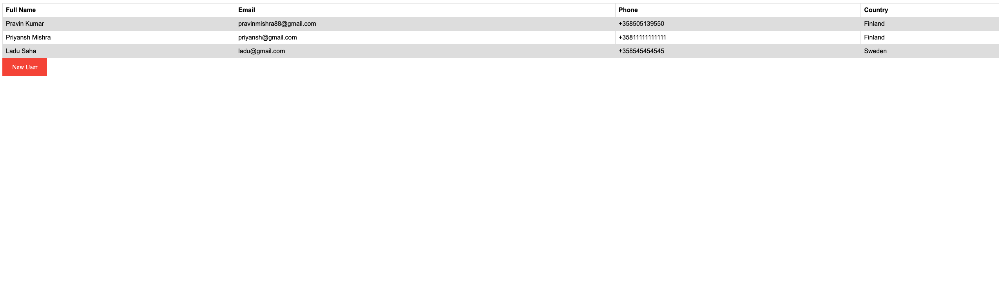

# Register for Workshop Application

## Install Golang to run the application (RHEL7)

Find latest Golang version from [here](https://golang.org/dl/). I am using Golang 15.5

```
yum update -y
yum install wget -y
wget https://golang.org/dl/go1.15.5.linux-amd64.tar.gz
tar -zxvf go1.15.5.linux-amd64.tar.gz -C /usr/local/
export PATH=$PATH:/usr/local/go/bin
mkdir $HOME/work
go version
```

## Clone application and Run

```
cd $HOME/work
git clone https://github.com/diatmpravin/workshop.git
```

## Start the application

Make sure to checkout to releant branch. There are thee bracch as of now. Master is development branch

```
cd workshop
git branch -r
git checkout -b LocalName origin/version1
go run main.go
```


## Screen shot -  New Regisration


## Screen shot -  All Regisration


